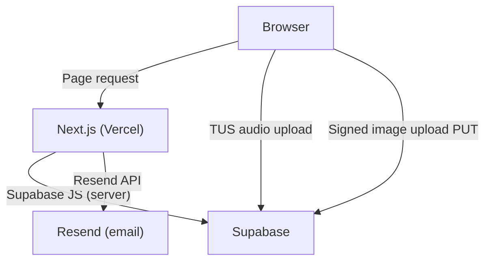

# Architecture

## Overview

SONORATIVA is a Next.js (App Router) application backed entirely by Supabase. There is no Payload CMS, no separate API server, and no middleware database proxy.

---

## Tech Stack

| Layer | Technology |
|---|---|
| Frontend | Next.js 16 (App Router) + React 19 |
| Styling | Tailwind CSS v4 + Shadcn/UI primitives |
| Backend | Supabase (PostgreSQL + Storage + Auth) |
| Email | Resend |
| Validation | Zod |
| Testing | Vitest (unit/integration) + Playwright (E2E) |
| Deployment | Vercel |

---

## High-Level Diagram



---

## Audio Upload Flow

Large audio files (WAV, up to 5 GB) bypass Next.js entirely:

```
Admin Browser
  │
  ├─ 1. Call server action: getTusUploadCredentials(bucket, path)
  │     └─ Returns: { uploadUrl, authToken }
  │
  ├─ 2. useTusUpload hook uploads directly to Supabase Storage
  │     └─ TUS protocol, 6 MB chunks
  │
  └─ 3. On completion, server action saves the storage path to the DB
        └─ supabase.from('showcase').update({ before_storage_path: path })
```

Key rule: **database fields store only the `objectPath`** (e.g. `track-id/before.wav`). The signed URL is generated at render time with a 1-hour expiry.

---

## Auth Flow

```
Request to /admin/*
  │
  ├─ middleware.ts checks Supabase session cookie
  │     └─ No session → redirect /admin/login
  │
  └─ AdminProtectedLayout checks profiles.role = 'admin'
        └─ Not admin → redirect /admin/login?error=forbidden
```

Admin server actions call `requireAdmin()` (from `app/admin/_actions/auth.ts`) at the top, which throws a redirect if the session is missing or the role is not `admin`.

---

## Content Rendering with Demo Fallback

```
app/page.tsx (Server Component)
  │
  ├─ isDev=true  → all services return mock data immediately
  │
  └─ isDev=false → services call Supabase
        │
        ├─ Data found → render real content
        │
        └─ Table empty → fall back to demo/mock data
              └─ DemoBadge shown if NEXT_PUBLIC_SHOW_DEMO_BADGE=true
```

The fallback is implemented inside each service (`services/*.ts`). The page component does not need to know whether data is real or demo — it always receives a non-empty array.

---

## Database Tables

| Table | Description |
|---|---|
| `profiles` | One row per Supabase Auth user. `role` column: `admin` / `user`. |
| `showcase` | Before/after audio tracks for the mastering player. |
| `credits` | Discography / client credits. |
| `reviews` | Client reviews / testimonials. |
| `gallery` | Studio photo gallery. |
| `members` | Team member profiles. |
| `services` | Service packages and pricing. |
| `site_content` | Key-value store for editable site copy. |
| `legal` | Legal pages (Impressum, Privacy, etc.). |
| `orders` | Order submissions from the contact form. |

All tables use Supabase Row-Level Security (RLS). Public read policies are enabled where appropriate. Write operations require an authenticated admin.

---

## Storage Buckets

| Bucket | Access | Used for |
|---|---|---|
| `audio-files` | Private (signed URLs) | Showcase before/after WAVs |
| `media` | Public | Gallery images, credit covers, member photos |
