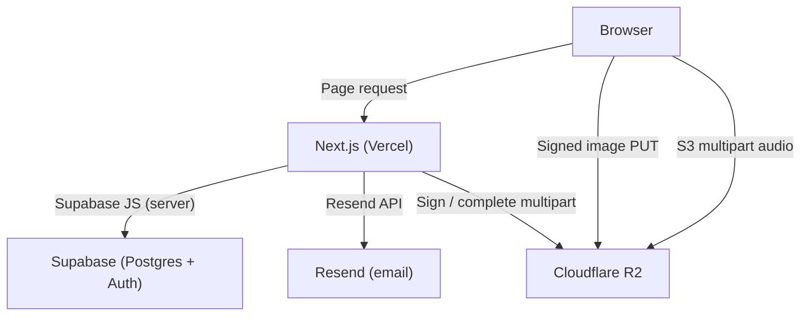

# Architecture

## Overview

SONORATIVA is a Next.js (App Router) application backed entirely by Supabase. There is no Payload CMS, no separate API server, and no middleware database proxy.

---

## Tech Stack

| Layer | Technology |
|---|---|
| Frontend | Next.js (App Router) + React 19 |
| Styling | Tailwind CSS v4 + Shadcn/UI primitives |
| Backend | Supabase (PostgreSQL + Auth) — **no** Payload CMS |
| Storage | **Cloudflare R2 only** (images public; audio private/signed) |
| Email | Resend |
| Validation | Zod |
| Testing | Vitest (unit/integration) + Playwright (E2E) |
| Deployment | Vercel |

> Agent-oriented architecture rules live in [docs/agent/architecture.md](agent/architecture.md).  
> This file is a human overview; if conflict, prefer `AGENTS.md` + `docs/agent/*`.

---

## High-Level Diagram


```mermaid
graph TD
    Browser["Browser"]
    NextJS["Next.js (Vercel)"]
    Supabase["Supabase (Postgres + Auth)"]
    R2["Cloudflare R2"]
    Resend["Resend (email)"]

    Browser -- "Page request" --> NextJS
    NextJS -- "Supabase JS (server)" --> Supabase
    NextJS -- "Resend API" --> Resend
    Browser -- "Signed image PUT" --> R2
    Browser -- "S3 multipart audio" --> R2
    NextJS -- "Sign / complete multipart" --> R2
```

---

## Audio Upload Flow

Large audio files (WAV, up to multi-GB) bypass Next.js as a data plane — R2 S3 Multipart only (**not** TUS / Supabase Storage):

```
Admin Browser
  │
  ├─ 1. Server actions: createMultipartUpload / signMultipartPart
  │     └─ (app/admin/_actions/r2Multipart.ts)
  │
  ├─ 2. useR2MultipartUpload uploads 6 MB chunks browser → R2
  │
  └─ 3. completeMultipartUpload → save object path on showcase
        └─ before_storage_path / after_storage_path
```

Key rule: **database fields store only the `objectPath`** (e.g. `track-id/before.wav`). The signed URL is generated at render time.

---

## Auth Flow

```
Request to /admin/*
  │
  ├─ middleware.ts checks Supabase session cookie
  │     └─ No session → redirect /admin/login
  │
  └─ AdminProtectedLayout checks profiles.role = 'admin'
        └─ Not admin → redirect /admin/login?error=forbidden
```

Admin server actions call `requireAdmin()` (from `app/admin/_actions/auth.ts`) at the top, which throws a redirect if the session is missing or the role is not `admin`.

---

## Content Rendering with Demo Fallback

```
app/page.tsx (Server Component)
  │
  ├─ isDev=true  → all services return mock data immediately
  │
  └─ isDev=false → services call Supabase
        │
        ├─ Data found → render real content
        │
        └─ Table empty → fall back to demo/mock data
              └─ DemoBadge shown if NEXT_PUBLIC_SHOW_DEMO_BADGE=true
```

The fallback is implemented inside each service (`services/*.ts`). The page component does not need to know whether data is real or demo — it always receives a non-empty array.

---

## Database Tables

| Table | Description |
|---|---|
| `profiles` | One row per Supabase Auth user. `role` column: `admin` / `user`. |
| `showcase` | Before/after audio tracks for the mastering player. |
| `credits` | Discography / client credits. |
| `partners` | Endorsement / partner logos (public logo grids). |
| `reviews` | Client reviews / testimonials. |
| `gallery` | Studio photo gallery. |
| `members` | Team member profiles. |
| `services` | Service packages and pricing. |
| `site_content` | Key-value store for editable site copy. |
| `legal` | Legal pages (Impressum, Privacy, etc.). |
| `orders` | Order submissions from the contact form. |

All tables use Supabase Row-Level Security (RLS). Public read policies are enabled where appropriate. Write operations use the service-role admin client after `requireAdmin()`.

---

## Storage Buckets

| Bucket | Access | Used for |
|---|---|---|
| `sonorativa-audio` | Private (signed URLs) | Showcase before/after WAVs |
| `sonorativa-media` | Public (`R2_PUBLIC_HOST`) | Gallery, credit covers, member photos, partner logos |
